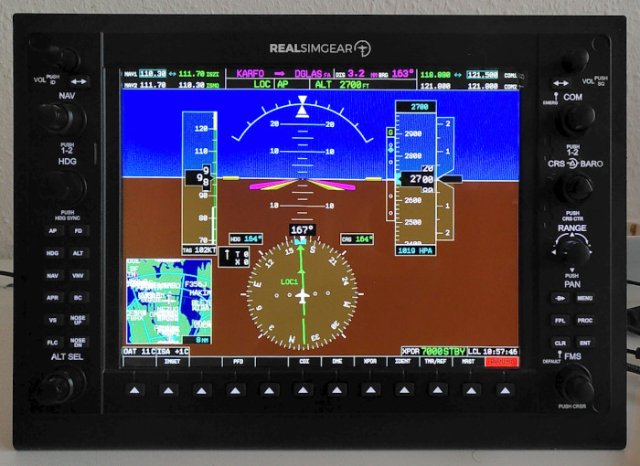
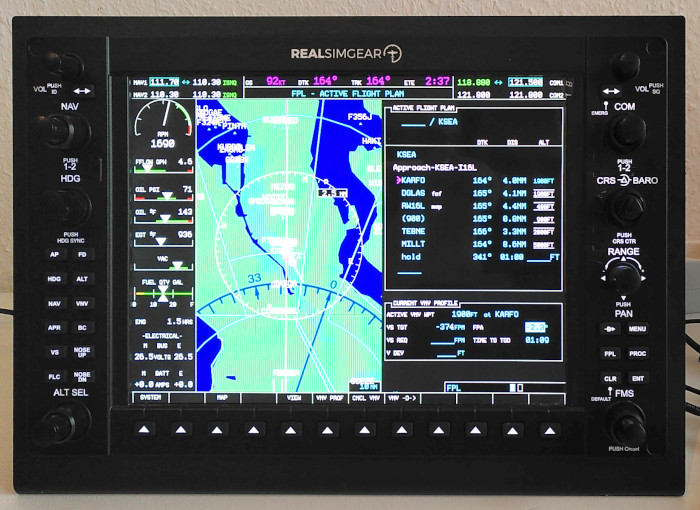

RealSimGear X-Plane Plugin for Linux
====================================

About the Plugin
----------------

### What it is

This plugin maps input controls of RealSimGear flight simulator devices to
X-Plane simulator commands.

### What it is not

This plugin doesn't help you detaching simulator windows and automatically
placing them onto the screen of your flight simulator device.


Showcase
--------






Installation
------------

The following software is required:

 * GCC C Compiler
 * GNU make
 * Lua 5.1

To build the plugin, open a terminal and just type `make` in the root directory
of this repo. You will find the compiled plugin at
`build/realsimgear/64/lin.xpl`

Copy the plugin to you X-Plane folder.

```
$ cp -r build/realsimgear "/opt/xplane/X-Plane 11/Resources/plugins/"
$ cp realsimgear.lua "/opt/xplane/X-Plane 11/Resources/plugins/realsimgear/"
```

We assume X-Plane is installed at `/opt/xplane/X-Plane 11`. Replace the path
according to your installation location.


Usage
-----

Before flying, you need to configure the plugin according to your flight
simulator setup. The configuration is done in the file `realsimgear.lua`. The
configuration already contains samples for all supported devices. You just need
to insert the device file paths for the simulator devices you want to use.

The configuration consists of the Lua list `devices` containing a table for
each simulator device.

```lua
devices =
{
  -- G1000: Pilot PFD
  {
    device = "/dev/ttyACM0",
    mapping = {} -- Insert mapping here
  },

  -- G1000: Co-Pilot PFD
  {
    device = nil,
    mapping = {} -- Insert mapping here
  },

  -- G1000: MFD
  {
    device = nil,
    mapping = {} -- Insert mapping here
  },
}
```

Each devices has the following attributes:

 * `device`: the linux device path
 * `mapping`: maps the input actuators to X-Plane commands

Just insert the path of the serial device file of your simulator device into
the relevant block. If `device` evaluates to `nil`, this device is considered
disabled. So you don't need to delete the devices blocks which are not
applicable for you.

Each time you push a button or turn a knob on your simulator device, a specific
control string is sent via the serial device. This string has to be mapped to a
X-Plane command. You will find a list of available simulator command at
https://www.siminnovations.com/xplane/command/. This mapping is done with the
`mapping`-attribute, which is itself a Lua table.

This is a sample mapping for a G1000 primary flight display (pilot side of the)
cockpit. Not all mappings are shown here for reason of simplicity.

```lua
devices =
{
  -- G1000: Pilot PFD
  {
    device = "/dev/ttyACM0",
    mapping =
    {
      ["ENC_NAV_VOL_DN"]   = "sim/GPS/g1000n1_nvol_dn",
      ["ENC_NAV_VOL_UP"]   = "sim/GPS/g1000n1_nvol_up",
      ["ENC_COM_VOL_DN"]   = "sim/GPS/g1000n1_cvol_dn",
      ["ENC_COM_VOL_UP"]   = "sim/GPS/g1000n1_cvol_up",
      ["BTN_NAV_VOL"]      = "sim/GPS/g1000n1_nvol",
      ["BTN_NAV_FF"]       = "sim/GPS/g1000n1_nav_ff",
      ["ENC_NAV_INNER_UP"] = "sim/GPS/g1000n1_nav_inner_up",
      ["ENC_NAV_INNER_DN"] = "sim/GPS/g1000n1_nav_inner_down",
      ["ENC_NAV_OUTER_UP"] = "sim/GPS/g1000n1_nav_outer_up",
      ["ENC_NAV_OUTER_DN"] = "sim/GPS/g1000n1_nav_outer_down",
      ["BTN_NAV_TOG"]      = "sim/GPS/g1000n1_nav12",
      ["ENC_HDG_UP"]       = "sim/GPS/g1000n1_hdg_up",
      ["ENC_HDG_DN"]       = "sim/GPS/g1000n1_hdg_down",
      ["BTN_HDG_SYNC"]     = "sim/GPS/g1000n1_hdg_sync",
      -- further mappings
    }
  },

  -- more devices
}
```

A G1000 MFD would send the same control strings, because it uses the same
hardware with the same actuators. But they actions to be performed are
different und thus have to be mapped to diffent simulator commands. In our case
the term `g1000n1` has just to be replaced by `g1000n3` to route all input
events to the MFD instead of the pilots PFD.


Miscellaneous
-------------

### Disclaimer

This plugin is not officially linked to RealSimGear. It's was founded by a user
of the hardware independently from the vendor. Thus it comes without warranty.

### Limitations

The configuration of your input devices is global. Currently there is no way to
define profiles for different aircrafts. You have to edit the configuration
file by hand each time you alter you simulator setup, for example when changing
between a C172 with a GNS430 and and one equipped with a G1000.

If you use multiple devices, please ensure the device paths are stable. You
can ensure this by plugging in the devices in a fixed order.

Currently the following devices are supported:

 - G1000 XFD

Virtually no modification of the plugin should be necessary to support other
devices. The configuration file just needs to be extend. Please contact me if
you own an unsupported device.
